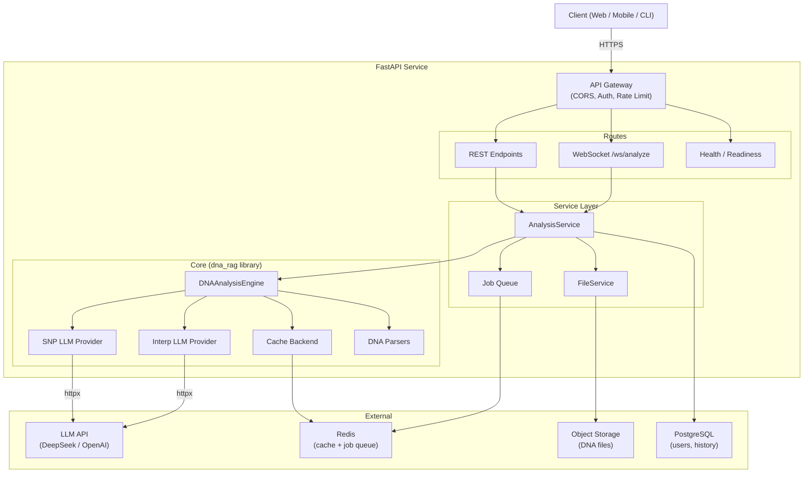
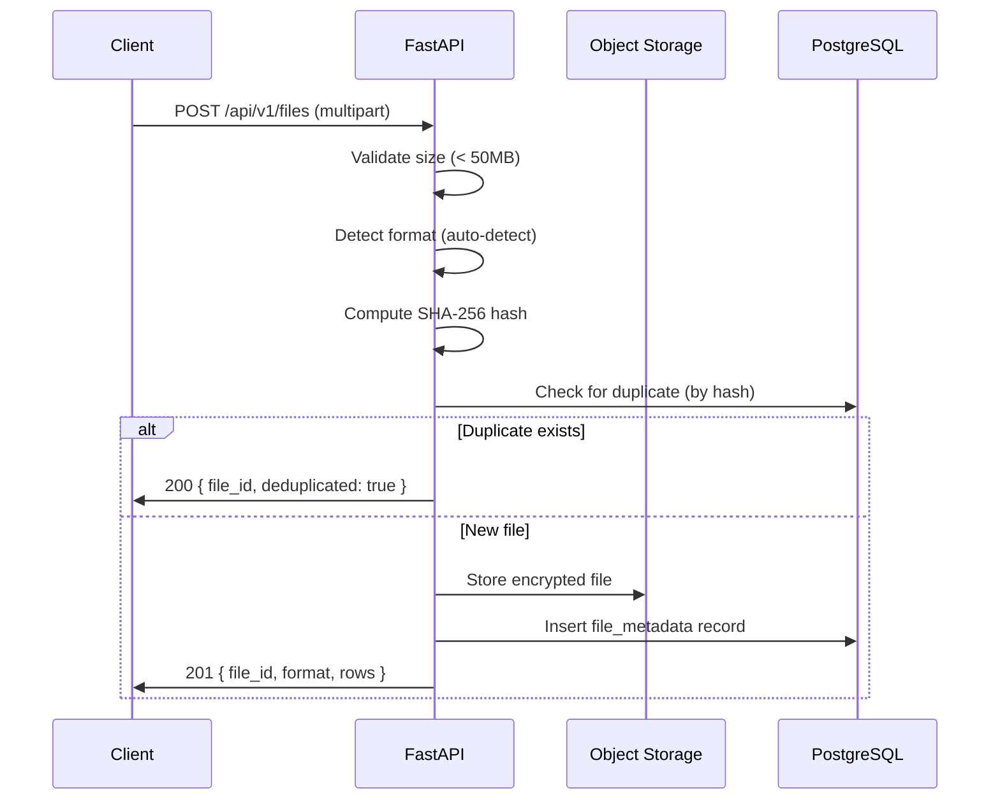
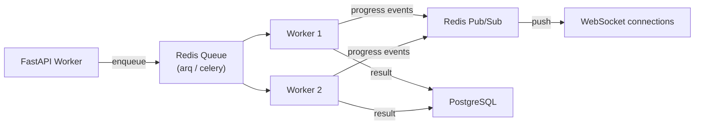

# DNA RAG — API Architecture

> Proposed FastAPI service design for the DNA RAG analysis engine.

This document describes the **target architecture** for wrapping the existing
`dna_rag` core engine in a production-grade HTTP + WebSocket service.
The core library (`src/dna_rag/`) remains the single source of truth for
business logic — the API layer is a thin adapter.

---

## Table of Contents

- [Design Goals](#design-goals)
- [High-Level Overview](#high-level-overview)
- [API Endpoints](#api-endpoints)
- [Data Models (Request / Response)](#data-models-request--response)
- [WebSocket Streaming](#websocket-streaming)
- [Authentication & Authorization](#authentication--authorization)
- [File Upload & Storage](#file-upload--storage)
- [Caching Strategy](#caching-strategy)
- [Background Jobs](#background-jobs)
- [Error Handling](#error-handling)
- [Middleware & Observability](#middleware--observability)
- [Configuration](#configuration)
- [Deployment](#deployment)
- [Project Structure](#project-structure)
- [Migration Path from CLI](#migration-path-from-cli)

---

## Design Goals

| # | Goal | Rationale |
|---|------|-----------|
| 1 | **Thin adapter over core** | All DNA logic stays in `dna_rag.engine`. The API layer does I/O, auth, and serialization — nothing else. |
| 2 | **Async-first** | FastAPI + `httpx.AsyncClient` for non-blocking LLM calls. |
| 3 | **Stateless HTTP** | No server-side sessions. DNA files are uploaded per-request or referenced by a previously uploaded ID. |
| 4 | **Observable** | Structured logging (structlog), OpenTelemetry traces, Prometheus metrics. |
| 5 | **12-Factor** | All config from env vars (`DNA_RAG_*`), no file-based secrets. |

---

## High-Level Overview



---

## API Endpoints

### Analysis

| Method | Path | Description |
|--------|------|-------------|
| `POST` | `/api/v1/analyze` | Synchronous analysis (upload file + question) |
| `POST` | `/api/v1/analyze/async` | Submit analysis job, returns job ID |
| `GET`  | `/api/v1/jobs/{job_id}` | Poll job status / retrieve result |
| `WS`   | `/ws/v1/analyze` | WebSocket with step-by-step streaming |

### File Management

| Method | Path | Description |
|--------|------|-------------|
| `POST` | `/api/v1/files` | Upload DNA file, returns `file_id` |
| `GET`  | `/api/v1/files/{file_id}` | File metadata (format, row count, hash) |
| `DELETE` | `/api/v1/files/{file_id}` | Remove uploaded file |

### System

| Method | Path | Description |
|--------|------|-------------|
| `GET` | `/health` | Liveness probe (returns 200) |
| `GET` | `/ready` | Readiness probe (checks LLM + cache + DB) |
| `GET` | `/api/v1/formats` | List supported DNA file formats |

---

## Data Models (Request / Response)

### `POST /api/v1/analyze`

**Request** (multipart/form-data):

```json
{
  "question": "What is my caffeine metabolism?",
  "file": "<binary DNA file>",
  "file_id": "optional — reference previously uploaded file",
  "output_format": "full | interpretation_only"
}
```

Either `file` (upload) or `file_id` (reference) is required.

**Response** (`200 OK`):

```json
{
  "id": "ana_01J8K...",
  "question": "What is my caffeine metabolism?",
  "matched_snps": [
    {
      "rsid": "rs762551",
      "chromosome": "15",
      "position": 75041917,
      "genotype": "AC",
      "gene": "CYP1A2",
      "trait": "Caffeine metabolism speed"
    }
  ],
  "interpretation": "Based on your CYP1A2 genotype ...",
  "snp_count_requested": 5,
  "snp_count_matched": 3,
  "cached": false,
  "processing_time_ms": 4200,
  "llm_models": {
    "snp_identification": "deepseek-r1",
    "interpretation": "gpt-4o-mini"
  }
}
```

**Error Response** (`422 / 400 / 500`):

```json
{
  "error": {
    "code": "NO_MATCHING_VARIANTS",
    "message": "None of the identified SNPs were found in your DNA file.",
    "details": {
      "snps_requested": 8,
      "snps_matched": 0
    }
  }
}
```

### `POST /api/v1/analyze/async`

**Response** (`202 Accepted`):

```json
{
  "job_id": "job_01J8K...",
  "status": "pending",
  "poll_url": "/api/v1/jobs/job_01J8K...",
  "websocket_url": "/ws/v1/jobs/job_01J8K..."
}
```

### `GET /api/v1/jobs/{job_id}`

**Response** (`200 OK`):

```json
{
  "job_id": "job_01J8K...",
  "status": "completed",
  "created_at": "2025-01-15T10:30:00Z",
  "completed_at": "2025-01-15T10:30:04Z",
  "result": { "...same as sync response..." }
}
```

Status values: `pending` → `running` → `completed` | `failed`.

---

## WebSocket Streaming

WebSocket enables real-time progress for the two-step pipeline.

```
Client                          Server
  |                                |
  |-- { question, file_id } ----->|
  |                                |
  |<-- { step: "parsing",         |
  |      status: "started" } -----|
  |                                |
  |<-- { step: "parsing",         |
  |      status: "done",          |
  |      rows: 610000 } ---------|
  |                                |
  |<-- { step: "snp_identification",
  |      status: "started",       |
  |      model: "deepseek-r1" } --|
  |                                |
  |<-- { step: "snp_identification",
  |      status: "done",          |
  |      snps_found: 5 } --------|
  |                                |
  |<-- { step: "filtering",       |
  |      status: "done",          |
  |      matched: 3 } -----------|
  |                                |
  |<-- { step: "interpretation",  |
  |      status: "started",       |
  |      model: "gpt-4o-mini" } --|
  |                                |
  |<-- { step: "interpretation",  |
  |      status: "streaming",     |
  |      chunk: "Based on..." } --|
  |                                |
  |<-- { step: "complete",        |
  |      result: { ... } } ------|
```

### Protocol Messages

```python
# Client → Server
class AnalyzeRequest(BaseModel):
    question: str
    file_id: str  # previously uploaded

# Server → Client
class ProgressEvent(BaseModel):
    step: Literal[
        "parsing",
        "snp_identification",
        "filtering",
        "interpretation",
        "complete",
        "error",
    ]
    status: Literal["started", "done", "streaming", "error"]
    data: dict | None = None  # step-specific payload
```

---

## Authentication & Authorization

### Phase 1 (MVP): API Key

```
Authorization: Bearer dna_key_01J8K...
```

- API keys stored in PostgreSQL, hashed with SHA-256.
- Keys scoped to rate limits (requests/min, files/day).
- Admin keys for management endpoints.

### Phase 2: OAuth 2.0 + JWT

```
Authorization: Bearer eyJhbGciOi...
```

- OIDC provider integration (Google, GitHub).
- Short-lived access tokens (15 min) + refresh tokens.
- RBAC: `user`, `admin` roles.

### Middleware

```python
# Dependency injection pattern
async def get_current_user(
    authorization: str = Header(...),
    db: AsyncSession = Depends(get_db),
) -> User:
    ...
```

---

## File Upload & Storage

### Upload Flow



### Storage Model

```python
class FileMetadata(SQLModel):
    id: str           # file_abc123
    user_id: str
    sha256: str       # deduplication key
    format: str       # "23andme" | "ancestrydna" | "myheritage"
    row_count: int
    size_bytes: int
    s3_key: str
    uploaded_at: datetime
    expires_at: datetime | None  # auto-cleanup
```

### Constraints

- Max file size: **50 MB** (covers all consumer DNA exports).
- Files encrypted at rest (AES-256 via S3 SSE).
- Auto-expiry after 30 days (configurable).
- Per-user file quota: 10 files (configurable).

---

## Caching Strategy

Three-tier caching aligned with the core engine:

```
┌──────────────────────────────────────────────────┐
│ L1: In-Process (InMemoryCache)                   │
│     - Per-worker, no network hop                 │
│     - TTL: 5 min, Max: 500 entries               │
│     - Good for: repeat questions within session   │
├──────────────────────────────────────────────────┤
│ L2: Redis                                        │
│     - Shared across workers                      │
│     - TTL: 1 hour (answers), 24h (SNP dicts)    │
│     - Good for: cross-user SNP knowledge         │
├──────────────────────────────────────────────────┤
│ L3: PostgreSQL (analysis_history)                │
│     - Permanent storage for user's past analyses │
│     - Good for: "show my previous results"       │
└──────────────────────────────────────────────────┘
```

### Cache Key Strategy

| Namespace | Key Pattern | TTL |
|-----------|-------------|-----|
| `answer` | `sha256(file):question_normalized` | 1h |
| `snp_dict` | `question_normalized` | 24h |
| `dna_file` | `sha256(file)` | 5min |

The `question_normalized` is a lowercased, stripped version of the question
to improve cache hit rates.

### Redis Cache Implementation

```python
class RedisCache:
    """Drop-in replacement implementing the Cache protocol."""

    def __init__(self, redis: Redis, prefix: str = "dna_rag") -> None:
        self._redis = redis
        self._prefix = prefix

    def get(self, namespace: str, key: str) -> Any | None:
        raw = self._redis.get(f"{self._prefix}:{namespace}:{key}")
        return pickle.loads(raw) if raw else None

    def set(self, namespace: str, key: str, value: Any) -> None:
        ttl = self._ttl_for(namespace)
        self._redis.setex(
            f"{self._prefix}:{namespace}:{key}",
            ttl,
            pickle.dumps(value),
        )
```

---

## Background Jobs

For long-running analyses (large files + slow LLMs):



### Technology Choice: **arq** (lightweight) or **Celery** (full-featured)

| Criteria | arq | Celery |
|----------|-----|--------|
| Complexity | Minimal | Heavy |
| Redis-native | Yes | Yes |
| Monitoring | Basic | Flower dashboard |
| Recommended for | MVP / small scale | High scale |

### Job Lifecycle

```python
class AnalysisJob(BaseModel):
    job_id: str
    status: Literal["pending", "running", "completed", "failed"]
    question: str
    file_id: str
    created_at: datetime
    started_at: datetime | None
    completed_at: datetime | None
    result: AnalysisResult | None
    error: str | None
```

---

## Error Handling

### Mapping Core Exceptions → HTTP Status Codes

| Core Exception | HTTP Status | Error Code |
|----------------|-------------|------------|
| `NoSNPsFoundError` | 422 | `NO_SNPS_FOUND` |
| `NoMatchingVariantsError` | 422 | `NO_MATCHING_VARIANTS` |
| `LLMResponseError` | 502 | `LLM_RESPONSE_ERROR` |
| `LLMConnectionError` | 502 | `LLM_UNAVAILABLE` |
| `LLMRateLimitError` | 503 | `LLM_RATE_LIMITED` |
| `UnsupportedFormatError` | 400 | `UNSUPPORTED_FORMAT` |
| `InvalidDNAFileError` | 400 | `INVALID_DNA_FILE` |
| `ConfigurationError` | 500 | `CONFIGURATION_ERROR` |
| `FileNotFoundError` | 404 | `FILE_NOT_FOUND` |

### Error Response Format (RFC 7807 inspired)

```python
class ErrorResponse(BaseModel):
    error: ErrorDetail

class ErrorDetail(BaseModel):
    code: str           # Machine-readable: "NO_MATCHING_VARIANTS"
    message: str        # Human-readable explanation
    details: dict | None = None  # Optional context
```

### Global Exception Handler

```python
@app.exception_handler(DNARagError)
async def dna_rag_error_handler(
    request: Request, exc: DNARagError
) -> JSONResponse:
    status, code = _map_exception(exc)
    return JSONResponse(
        status_code=status,
        content=ErrorResponse(
            error=ErrorDetail(code=code, message=str(exc))
        ).model_dump(),
    )
```

---

## Middleware & Observability

### Middleware Stack

```python
app = FastAPI(title="DNA RAG API", version="1.0.0")

# Order matters — outermost first
app.add_middleware(
    CORSMiddleware,
    allow_origins=settings.cors_origins,
    allow_methods=["*"],
    allow_headers=["*"],
)
app.add_middleware(RequestIdMiddleware)      # X-Request-ID header
app.add_middleware(StructlogMiddleware)      # Structured access logs
app.add_middleware(PrometheusMiddleware)     # Request metrics
app.add_middleware(
    RateLimitMiddleware,
    limit="60/minute",
    key_func=get_api_key,
)
```

### Structured Logging

Extends the core `structlog` setup with request context:

```python
# Automatic fields per request:
{
    "event": "analysis_complete",
    "request_id": "req_01J8K...",
    "user_id": "usr_...",
    "method": "POST",
    "path": "/api/v1/analyze",
    "status_code": 200,
    "duration_ms": 4200,
    "snps_requested": 5,
    "snps_matched": 3
}
```

### Metrics (Prometheus)

| Metric | Type | Labels |
|--------|------|--------|
| `dna_rag_requests_total` | Counter | method, path, status |
| `dna_rag_request_duration_seconds` | Histogram | method, path |
| `dna_rag_analysis_duration_seconds` | Histogram | step (snp/interp) |
| `dna_rag_llm_calls_total` | Counter | provider, model, status |
| `dna_rag_cache_hits_total` | Counter | namespace |
| `dna_rag_active_websockets` | Gauge | — |

### Health Checks

```python
@router.get("/health")
async def health():
    return {"status": "ok"}

@router.get("/ready")
async def readiness(
    engine: DNAAnalysisEngine = Depends(get_engine),
    redis: Redis = Depends(get_redis),
    db: AsyncSession = Depends(get_db),
):
    checks = {
        "cache": await check_redis(redis),
        "database": await check_db(db),
        "llm": await check_llm(engine),
    }
    status = "ok" if all(checks.values()) else "degraded"
    return {"status": status, "checks": checks}
```

---

## Configuration

Extends the existing `Settings` class (see `src/dna_rag/api/config.py`):

```python
class APISettings(Settings):
    """API-specific settings (extends core Settings)."""

    # Server
    api_host: str = "0.0.0.0"
    api_port: int = 8000
    api_workers: int = 1
    cors_origins: list[str] = ["*"]

    # Auth
    auth_enabled: bool = False
    api_keys: list[str] = []  # DNA_RAG_API_KEYS='key1,key2'

    # File storage (local disk, PoC)
    upload_dir: str = "/tmp/dna_rag_uploads"
    file_max_size_mb: int = 50   # 1–200
    file_retention_hours: int = 24

    # Rate limiting
    rate_limit_per_minute: int = 60

    # Jobs
    job_ttl_seconds: int = 3600
```

All variables use the same `DNA_RAG_` prefix:

```bash
DNA_RAG_API_HOST=0.0.0.0
DNA_RAG_API_PORT=8000
DNA_RAG_AUTH_ENABLED=true
DNA_RAG_API_KEYS=key1,key2
DNA_RAG_UPLOAD_DIR=/var/lib/dna_rag/uploads
```

> **Note:** The target architecture diagram above includes Redis, PostgreSQL,
> and S3 which are not yet implemented. The current PoC uses in-memory job
> storage and local filesystem for uploads.

---

## Deployment

### Docker

```dockerfile
FROM python:3.11-slim AS base
WORKDIR /app
COPY pyproject.toml .
RUN pip install --no-cache-dir ".[api]"
COPY src/ src/

FROM base AS api
CMD ["uvicorn", "dna_rag.api.main:app", "--host", "0.0.0.0", "--port", "8000"]

FROM base AS worker
CMD ["arq", "dna_rag.api.worker.WorkerSettings"]
```

### Docker Compose (Development)

```yaml
services:
  api:
    build: { target: api }
    ports: ["8000:8000"]
    env_file: .env
    depends_on: [redis, postgres]

  worker:
    build: { target: worker }
    env_file: .env
    depends_on: [redis, postgres]

  redis:
    image: redis:7-alpine
    ports: ["6379:6379"]

  postgres:
    image: postgres:16-alpine
    environment:
      POSTGRES_DB: dna_rag
      POSTGRES_USER: dna_rag
      POSTGRES_PASSWORD: dev-password
    ports: ["5432:5432"]
```

### Kubernetes (Production)

```yaml
# Key resources
- Deployment: api (2-4 replicas, HPA on CPU)
- Deployment: worker (1-2 replicas, HPA on queue depth)
- Service: api (ClusterIP → Ingress)
- ConfigMap: dna-rag-config
- Secret: dna-rag-secrets (API keys, JWT secret)
- PersistentVolumeClaim: — (stateless, S3 for files)
```

---

## Project Structure

```
src/dna_rag/
├── __init__.py              # Core public API (existing)
├── engine.py                # Core engine (existing)
├── models.py                # Core models (existing)
├── ...                      # All existing core modules
│
└── api/                     # NEW: FastAPI layer
    ├── __init__.py
    ├── main.py              # FastAPI app factory
    ├── config.py            # APISettings (extends core Settings)
    ├── dependencies.py      # Dependency injection (get_engine, get_db, ...)
    ├── routes/
    │   ├── __init__.py
    │   ├── analyze.py       # POST /api/v1/analyze, /analyze/async
    │   ├── files.py         # File upload / management
    │   ├── jobs.py          # GET /api/v1/jobs/{id}
    │   ├── health.py        # /health, /ready
    │   └── websocket.py     # WS /ws/v1/analyze
    ├── schemas/
    │   ├── __init__.py
    │   ├── requests.py      # AnalyzeRequest, FileUploadResponse
    │   └── responses.py     # AnalysisResponse, ErrorResponse, JobResponse
    ├── middleware/
    │   ├── __init__.py
    │   ├── request_id.py    # X-Request-ID injection
    │   ├── logging.py       # structlog access logs
    │   ├── rate_limit.py    # Token bucket rate limiter
    │   └── auth.py          # API key / JWT verification
    ├── services/
    │   ├── __init__.py
    │   ├── analysis.py      # Orchestrates engine + file lookup + caching
    │   └── files.py         # S3 upload/download, dedup
    ├── cache/
    │   └── redis.py         # RedisCache implementing Cache protocol
    ├── db/
    │   ├── __init__.py
    │   ├── models.py        # SQLModel: User, FileMetadata, AnalysisHistory
    │   └── session.py       # Async SQLAlchemy session factory
    └── worker.py            # arq worker settings + task definitions
```

---

## Migration Path from CLI

The existing CLI (`dna-rag ask`, `dna-rag interactive`) continues to work.
The API is an **additional** entry point, not a replacement.

```
                    ┌────────────┐
                    │   config   │ ← Shared Settings
                    └─────┬──────┘
                          │
              ┌───────────┼───────────┐
              │           │           │
         ┌────┴───┐  ┌───┴────┐  ┌───┴────┐
         │  CLI   │  │  API   │  │ Python │
         │(click) │  │(Fast   │  │  SDK   │
         │        │  │ API)   │  │        │
         └────┬───┘  └───┬────┘  └───┬────┘
              │           │           │
              └───────────┼───────────┘
                          │
                 ┌────────┴────────┐
                 │ DNAAnalysisEngine│ ← Core (unchanged)
                 └─────────────────┘
```

### Step-by-step Migration

1. **Add `[api]` extra** to `pyproject.toml`:
   ```toml
   [project.optional-dependencies]
   api = [
       "fastapi>=0.110",
       "uvicorn[standard]>=0.27",
       "python-multipart>=0.0.6",
       "sqlmodel>=0.0.14",
       "asyncpg>=0.29",
       "redis>=5.0",
       "arq>=0.25",
   ]
   ```

2. **Implement `api/` package** following the structure above.

3. **Add entry point**:
   ```toml
   [project.scripts]
   dna-rag = "dna_rag.cli:main"
   dna-rag-api = "dna_rag.api.main:run"
   ```

4. **Write API tests** using `httpx.AsyncClient` + `TestClient`.

5. **Deploy** behind a reverse proxy (nginx / Caddy / cloud LB).

---

## Security Considerations

| Concern | Mitigation |
|---------|------------|
| DNA data is PII | Encrypted at rest (S3 SSE), HTTPS only, auto-expiry |
| DNA data sent to LLM provider | User provides own API key; subject to provider's privacy policy ([OpenAI](https://openai.com/policies/privacy-policy), [DeepSeek](https://www.deepseek.com/privacy)). UI and README warn users explicitly. |
| Not medical advice | Medical disclaimer in README, UI, and every LLM response (configurable via `DNA_RAG_MEDICAL_DISCLAIMER`). |
| LLM hallucination (invalid SNPs) | Pydantic validation of LLM output, RSID format filtering (`rs*`), optional NCBI dbSNP verification. |
| LLM prompt injection | System prompts are server-side, user input sanitized |
| API key leakage | Keys hashed in DB, rotatable, scoped permissions |
| Rate limiting | Per-key limits, Redis-backed sliding window |
| File upload abuse | Size limits, format validation before storage |
| CORS | Configurable origins, locked down in production |

---

## License

This architecture document is part of the DNA RAG project (MIT).
