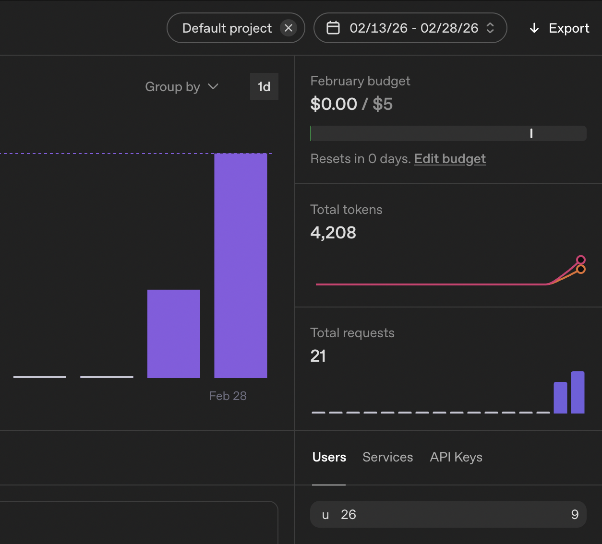
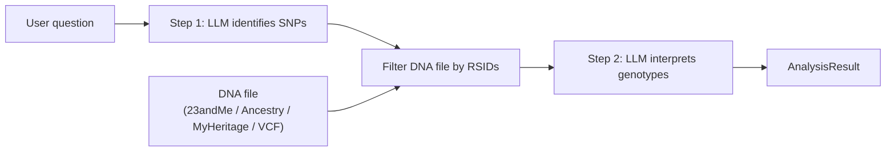

# DNA RAG

[](https://pypi.org/project/dna-rag/)
[](https://pypi.org/project/dna-rag/)
[](https://pypi.org/project/dna-rag/)
[](https://github.com/ice1x/DNA_RAG/blob/main/LICENSE)

> Analyse your personal DNA data using Large Language Models.

> **⚠️ Not medical advice.** This tool is for **educational and research purposes only**. Do not make health decisions based on its output. Always consult a qualified healthcare provider or genetic counselor for medical interpretation of genetic data.

**[Try it live on Hugging Face Spaces](https://huggingface.co/spaces/ice1x/DNA_RAG)** — bring your own API key from DeepSeek or any OpenAI-compatible provider.

> 💡 **Cost:** 2 days of active testing with OpenAI API didn't even cost $0.01 in tokens.
>
> 

**DNA RAG** is a Python pipeline that answers questions about personal genetic data from consumer DNA testing services (23andMe, AncestryDNA, MyHeritage, VCF). It uses a two-step LLM approach:

1. **SNP identification** — the LLM determines which genetic variants (SNPs) are relevant to the user's question.
2. **Interpretation** — the user's DNA file is filtered for those variants, and the LLM interprets the matched genotypes.

## Quick Start

### 1. Install

```bash
# Engine only (no FastAPI, no Streamlit)
pip install dna-rag

# With Streamlit UI
pip install dna-rag[ui]

# With API server
pip install dna-rag[api]

# Everything
pip install dna-rag[api,ui,rag]
```

**Development (from source):**

```bash
pip install -e ".[dev]"
pip install -e ".[dev,api,ui]"
```

### 2. Configure

```bash
cp .env.example .env
```

Edit `.env` — pick your provider:

**DeepSeek** (default):

```bash
DNA_RAG_LLM_PROVIDER=deepseek
DNA_RAG_LLM_API_KEY=your-deepseek-key
DNA_RAG_LLM_MODEL=deepseek-r1:free
DNA_RAG_LLM_BASE_URL=https://api.deepseek.com/v1
```

**OpenAI** (or any OpenAI-compatible API):

```bash
DNA_RAG_LLM_PROVIDER=openai_compat
DNA_RAG_LLM_API_KEY=sk-your-openai-key
DNA_RAG_LLM_MODEL=gpt-4o-mini
DNA_RAG_LLM_BASE_URL=https://api.openai.com/v1
```

The `openai_compat` provider works with any API that implements the OpenAI `/chat/completions` format. Only **OpenAI** and **DeepSeek** have been tested with real DNA data.

**Per-step LLM** (optional) — use a different model for the interpretation step:

```bash
# Interpretation step overrides (falls back to primary if not set)
DNA_RAG_LLM_INTERP_PROVIDER=openai_compat
DNA_RAG_LLM_INTERP_API_KEY=sk-your-openai-key
DNA_RAG_LLM_INTERP_MODEL=gpt-4o-mini
DNA_RAG_LLM_INTERP_BASE_URL=https://api.openai.com/v1
```

### 3. Run Tests

```bash
# All tests (194 tests, ~82% coverage)
pytest

# Quick run without coverage
pytest --override-ini="addopts=-v" --no-header

# Only unit tests
pytest tests/unit/ -v

# Only API tests
pytest tests/api/ -v

# Only integration tests
pytest tests/integration/ -v

# Specific module
pytest tests/test_vcf_parser.py -v
pytest tests/test_polygenic.py -v
pytest tests/test_snp_database.py -v
```

### 4. Lint & Type Check

```bash
ruff check src/ tests/
mypy src/dna_rag/ --exclude vector_store.py
```

### 5. Use the CLI

```bash
# Single question
dna-rag ask --dna-file path/to/genome.csv --question "lactose tolerance"

# JSON output
dna-rag ask --dna-file path/to/genome.csv --question "lactose tolerance" --output-format json

# Interactive session
dna-rag interactive --dna-file path/to/genome.csv
```

### 6. Run the API Server

```bash
# Direct
dna-rag-api

# Or via Docker
make docker-build
make docker-up
```

API available at `http://localhost:8000`:

```bash
# Health check
curl http://localhost:8000/health

# Analyze (with file upload)
curl -X POST http://localhost:8000/api/v1/analyze \
  -F "file=@genome_data.csv" \
  -F "question=lactose tolerance"

# Supported formats
curl http://localhost:8000/api/v1/formats
```

## Architecture



### Key Design Principles

- **LLM-agnostic** — each pipeline step can use a different LLM provider via Python Protocols
- **Pluggable** — cache backends, LLM providers, and DNA parsers are all injected via constructor
- **Structured output** — Pydantic models validate LLM responses and pipeline results
- **Lightweight core** — only 7 runtime deps; heavy libs (chromadb, sentence-transformers) behind `[rag]` extra

## Python API

```python
from pathlib import Path
from dna_rag import DNAAnalysisEngine, Settings
from dna_rag.llm.deepseek import DeepSeekProvider
from dna_rag.cache import InMemoryCache

settings = Settings()  # reads DNA_RAG_* env vars
engine = DNAAnalysisEngine(
    snp_llm=DeepSeekProvider(settings),
    cache=InMemoryCache(),
)

result = engine.analyze("lactose tolerance", Path("genome_data.csv"))
print(result.interpretation)
print(f"Matched {result.snp_count_matched}/{result.snp_count_requested} SNPs")
```

### Per-Step LLM Selection

```python
from dna_rag.llm.deepseek import DeepSeekProvider
from dna_rag.llm.openai_compat import OpenAICompatProvider

engine = DNAAnalysisEngine(
    snp_llm=DeepSeekProvider(snp_settings),           # reasoning model
    interpretation_llm=OpenAICompatProvider(interp_settings),  # cheaper model
    cache=InMemoryCache(),
)
```

### Polygenic Risk Scores

```python
from dna_rag.polygenic import PolygenicScoreCalculator
from dna_rag.parsers.detector import detect_and_parse

df = detect_and_parse(Path("genome_data.csv"))
calc = PolygenicScoreCalculator()
result = calc.calculate("alzheimers_risk", df)
print(result.interpretation)
```

### SNP Validation

```python
from dna_rag.snp_database import SNPDatabase

db = SNPDatabase()
info = db.validate_rsid("rs429358")
print(f"{info.rsid}: gene={info.gene}, chr={info.chromosome}")
```

## Supported DNA Formats

Input files are **tabular data** (TSV/CSV) exported by DNA testing services.
Format is auto-detected by file content (header), not extension.

| Service | File type | Delimiter | Example file |
|---------|-----------|-----------|--------------|
| VCF | `.vcf`, `.vcf.gz` | Tab | `genome.vcf` |
| 23andMe | `.txt` (TSV) | Tab | `genome_John_Doe.txt` |
| AncestryDNA | `.txt` (TSV) | Tab | `AncestryDNA_raw.txt` |
| MyHeritage | `.csv` | Comma | `MyHeritage_raw.csv` |

> **Tested with** real DNA data purchased from [MyHeritage](https://www.myheritage.com/).

## Configuration

All settings via `DNA_RAG_`-prefixed env vars or `.env` file.

### Primary LLM (SNP identification + default)

| Variable | Default | Description |
|----------|---------|-------------|
| `DNA_RAG_LLM_API_KEY` | *required* | API key for the LLM provider |
| `DNA_RAG_LLM_PROVIDER` | `deepseek` | `deepseek` or `openai_compat` |
| `DNA_RAG_LLM_MODEL` | `deepseek-r1:free` | Model name |
| `DNA_RAG_LLM_BASE_URL` | `https://api.deepseek.com/v1` | API base URL |
| `DNA_RAG_LLM_TEMPERATURE` | `0.0` | Sampling temperature (`0.0`–`2.0`) |
| `DNA_RAG_LLM_MAX_TOKENS` | — | Max response tokens (provider default if unset) |
| `DNA_RAG_LLM_TIMEOUT` | `60.0` | Request timeout in seconds |
| `DNA_RAG_LLM_MAX_RETRIES` | `3` | Retries on connection/rate-limit errors (`0`–`10`) |

### Interpretation LLM (optional, overrides primary for step 2)

If not set, the primary LLM settings are used for both steps.

| Variable | Default | Description |
|----------|---------|-------------|
| `DNA_RAG_LLM_INTERP_PROVIDER` | — | `deepseek` or `openai_compat` |
| `DNA_RAG_LLM_INTERP_API_KEY` | — | API key (falls back to primary) |
| `DNA_RAG_LLM_INTERP_MODEL` | — | Model name (falls back to primary) |
| `DNA_RAG_LLM_INTERP_BASE_URL` | — | API base URL (falls back to primary) |
| `DNA_RAG_LLM_INTERP_TEMPERATURE` | `0.0` | Sampling temperature |
| `DNA_RAG_LLM_INTERP_MAX_TOKENS` | — | Max response tokens |
| `DNA_RAG_LLM_INTERP_TIMEOUT` | `60.0` | Request timeout in seconds |
| `DNA_RAG_LLM_INTERP_MAX_RETRIES` | `3` | Retries on connection/rate-limit errors |

### Cache, Logging, Parser

| Variable | Default | Description |
|----------|---------|-------------|
| `DNA_RAG_CACHE_BACKEND` | `memory` | `memory` or `none` |
| `DNA_RAG_CACHE_MAX_SIZE` | `1000` | Max cached entries |
| `DNA_RAG_CACHE_TTL_SECONDS` | `3600` | Cache entry lifetime in seconds |
| `DNA_RAG_LOG_LEVEL` | `INFO` | Logging level |
| `DNA_RAG_LOG_FORMAT` | `console` | `console` or `json` |
| `DNA_RAG_DEFAULT_DNA_FORMAT` | `auto` | `auto`, `23andme`, `ancestrydna`, or `myheritage` |

## Project Structure

```
src/dna_rag/
    engine.py            # Core 2-step LLM pipeline
    config.py            # Pydantic Settings
    models.py            # Data models (SNPResult, AnalysisResult)
    exceptions.py        # Exception hierarchy
    polygenic.py         # Polygenic risk score calculator
    snp_database.py      # NCBI dbSNP validation client
    vector_store.py      # Optional ChromaDB RAG (requires [rag])
    cli.py               # Click CLI
    llm/                 # LLM protocol + providers (DeepSeek, OpenAI-compat)
    cache/               # Cache protocol + in-memory backend
    parsers/             # DNA parsers (23andMe, AncestryDNA, MyHeritage, VCF)
    api/                 # FastAPI server
        routes/          #   REST + WebSocket endpoints
        middleware/       #   Auth, rate-limit, request-id
        services/        #   Analysis, file management, async jobs
        schemas/         #   Request/response models
tests/
    unit/                # Unit tests for all modules
    api/                 # API endpoint tests
    integration/         # CLI + engine integration tests
    test_vcf_parser.py   # VCF parser tests
    test_polygenic.py    # Polygenic calculator tests
    test_snp_database.py # SNP database client tests
```

## Makefile

```bash
make help          # Show all targets
make install       # pip install -e ".[dev,api]"
make test          # pytest
make lint          # ruff check
make typecheck     # mypy
make check         # lint + typecheck + test
make serve         # Run API server
make docker-build  # Build Docker image
make docker-up     # Start via docker-compose
```

## API Documentation

- [docs/API.md](docs/API.md) — endpoint reference, request/response examples
- [ARCHITECTURE.md](ARCHITECTURE.md) — FastAPI design document and target architecture

Interactive docs available at `http://localhost:8000/docs` when server is running.

## Privacy & Data

**Your genetic data is sensitive.** Understand how it is processed:

- **You provide your own API key.** DNA data is sent to your chosen LLM provider and is subject to that provider's privacy policy and data retention rules. Review your provider's terms: [OpenAI Privacy Policy](https://openai.com/policies/privacy-policy), [DeepSeek Privacy Policy](https://www.deepseek.com/privacy).
- **No data is stored by this tool.** DNA RAG does not collect, store, or transmit your genetic data to any third party. All processing happens in your session.
- **Every response includes a medical disclaimer** (configurable via `DNA_RAG_MEDICAL_DISCLAIMER`) reminding that genetic predisposition is not deterministic and recommending consultation with a healthcare professional. The LLM translates it into the response language.

## Guardrails

This tool is **not a medical device** and does not replace professional genetic counseling. Built-in safeguards:

- **Structured LLM output** — Pydantic models validate every LLM response; malformed or unexpected output is rejected, not silently passed through.
- **RSID format validation** — only SNP identifiers matching the `rs*` format are accepted; arbitrary text from the LLM is filtered out.
- **Optional NCBI dbSNP validation** — when enabled (`DNA_RAG_VALIDATION_ENABLED=true`), each LLM-identified RSID is verified against the NCBI dbSNP database to confirm it is a real, known variant.
- **Medical disclaimer in every response** — a configurable disclaimer is appended to each interpretation, translated into the user's language.
- **No diagnosis or treatment recommendations** — the LLM prompt asks for genotype interpretation only, not medical advice.

## License

MIT
