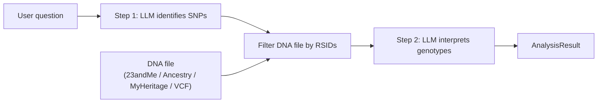

# DNA RAG

> Analyse your personal DNA data using Large Language Models.

**DNA RAG** is a Python pipeline that answers questions about personal genetic data from consumer DNA testing services (23andMe, AncestryDNA, MyHeritage, VCF). It uses a two-step LLM approach:

1. **SNP identification** — the LLM determines which genetic variants (SNPs) are relevant to the user's question.
2. **Interpretation** — the user's DNA file is filtered for those variants, and the LLM interprets the matched genotypes.

## Quick Start

### 1. Install

```bash
# Core + dev tools
pip install -e ".[dev]"

# With API server
pip install -e ".[dev,api]"

# With vector store (RAG, optional — pulls PyTorch)
pip install -e ".[rag]"
```

### 2. Configure

```bash
cp .env.example .env
```

Edit `.env`:

```bash
DNA_RAG_LLM_API_KEY=your-api-key-here
DNA_RAG_LLM_PROVIDER=deepseek          # or openai_compat
DNA_RAG_LLM_MODEL=deepseek-r1:free
```

### 3. Run Tests

```bash
# All tests (194 tests, ~82% coverage)
pytest

# Quick run without coverage
pytest --override-ini="addopts=-v" --no-header

# Only unit tests
pytest tests/unit/ -v

# Only API tests
pytest tests/api/ -v

# Only integration tests
pytest tests/integration/ -v

# Specific module
pytest tests/test_vcf_parser.py -v
pytest tests/test_polygenic.py -v
pytest tests/test_snp_database.py -v
```

### 4. Lint & Type Check

```bash
ruff check src/ tests/
mypy src/dna_rag/ --exclude vector_store.py
```

### 5. Use the CLI

```bash
# Single question
dna-rag ask --dna-file path/to/dna.txt --question "lactose tolerance"

# JSON output
dna-rag ask --dna-file path/to/dna.txt --question "lactose tolerance" --output-format json

# Interactive session
dna-rag interactive --dna-file path/to/dna.txt
```

### 6. Run the API Server

```bash
# Direct
dna-rag-api

# Or via Docker
make docker-build
make docker-up
```

API available at `http://localhost:8000`:

```bash
# Health check
curl http://localhost:8000/health

# Analyze (with file upload)
curl -X POST http://localhost:8000/api/v1/analyze \
  -F "file=@my_dna.txt" \
  -F "question=lactose tolerance"

# Supported formats
curl http://localhost:8000/api/v1/formats
```

## Architecture



### Key Design Principles

- **LLM-agnostic** — each pipeline step can use a different LLM provider via Python Protocols
- **Pluggable** — cache backends, LLM providers, and DNA parsers are all injected via constructor
- **Structured output** — Pydantic models validate LLM responses and pipeline results
- **Lightweight core** — only 7 runtime deps; heavy libs (chromadb, sentence-transformers) behind `[rag]` extra

## Python API

```python
from pathlib import Path
from dna_rag import DNAAnalysisEngine, Settings
from dna_rag.llm.deepseek import DeepSeekProvider
from dna_rag.cache import InMemoryCache

settings = Settings()  # reads DNA_RAG_* env vars
engine = DNAAnalysisEngine(
    snp_llm=DeepSeekProvider(settings),
    cache=InMemoryCache(),
)

result = engine.analyze("lactose tolerance", Path("my_dna.txt"))
print(result.interpretation)
print(f"Matched {result.snp_count_matched}/{result.snp_count_requested} SNPs")
```

### Per-Step LLM Selection

```python
from dna_rag.llm.deepseek import DeepSeekProvider
from dna_rag.llm.openai_compat import OpenAICompatProvider

engine = DNAAnalysisEngine(
    snp_llm=DeepSeekProvider(snp_settings),           # reasoning model
    interpretation_llm=OpenAICompatProvider(interp_settings),  # cheaper model
    cache=InMemoryCache(),
)
```

### Polygenic Risk Scores

```python
from dna_rag.polygenic import PolygenicScoreCalculator
from dna_rag.parsers.detector import detect_and_parse

df = detect_and_parse(Path("my_dna.txt"))
calc = PolygenicScoreCalculator()
result = calc.calculate("alzheimers_risk", df)
print(result.interpretation)
```

### SNP Validation

```python
from dna_rag.snp_database import SNPDatabase

db = SNPDatabase()
info = db.validate_rsid("rs429358")
print(f"{info.rsid}: gene={info.gene}, chr={info.chromosome}")
```

## Supported DNA Formats

| Format | Extension | Delimiter | Auto-detected |
|--------|-----------|-----------|---------------|
| VCF | `.vcf`, `.vcf.gz` | Tab | ✅ |
| 23andMe | `.txt` | Tab | ✅ |
| AncestryDNA | `.txt` | Tab | ✅ |
| MyHeritage | `.csv` | Comma | ✅ |

## Configuration

All settings via `DNA_RAG_`-prefixed env vars or `.env` file:

| Variable | Default | Description |
|----------|---------|-------------|
| `DNA_RAG_LLM_API_KEY` | *required* | API key for the LLM provider |
| `DNA_RAG_LLM_PROVIDER` | `deepseek` | `deepseek` or `openai_compat` |
| `DNA_RAG_LLM_MODEL` | `deepseek-r1:free` | Model name |
| `DNA_RAG_LLM_BASE_URL` | `https://api.deepseek.com/v1` | API base URL |
| `DNA_RAG_LLM_INTERP_PROVIDER` | — | Separate provider for interpretation step |
| `DNA_RAG_LLM_INTERP_MODEL` | — | Separate model for interpretation step |
| `DNA_RAG_CACHE_BACKEND` | `memory` | `memory` or `none` |
| `DNA_RAG_LOG_LEVEL` | `INFO` | Logging level |
| `DNA_RAG_LOG_FORMAT` | `console` | `console` or `json` |

## Project Structure

```
src/dna_rag/
    engine.py            # Core 2-step LLM pipeline
    config.py            # Pydantic Settings
    models.py            # Data models (SNPResult, AnalysisResult)
    exceptions.py        # Exception hierarchy
    polygenic.py         # Polygenic risk score calculator
    snp_database.py      # NCBI dbSNP validation client
    vector_store.py      # Optional ChromaDB RAG (requires [rag])
    cli.py               # Click CLI
    llm/                 # LLM protocol + providers (DeepSeek, OpenAI-compat)
    cache/               # Cache protocol + in-memory backend
    parsers/             # DNA parsers (23andMe, AncestryDNA, MyHeritage, VCF)
    api/                 # FastAPI server
        routes/          #   REST + WebSocket endpoints
        middleware/       #   Auth, rate-limit, request-id
        services/        #   Analysis, file management, async jobs
        schemas/         #   Request/response models
tests/
    unit/                # Unit tests for all modules
    api/                 # API endpoint tests
    integration/         # CLI + engine integration tests
    test_vcf_parser.py   # VCF parser tests
    test_polygenic.py    # Polygenic calculator tests
    test_snp_database.py # SNP database client tests
```

## Makefile

```bash
make help          # Show all targets
make install       # pip install -e ".[dev,api]"
make test          # pytest
make lint          # ruff check
make typecheck     # mypy
make check         # lint + typecheck + test
make serve         # Run API server
make docker-build  # Build Docker image
make docker-up     # Start via docker-compose
```

## API Documentation

See [ARCHITECTURE.md](ARCHITECTURE.md) for the full FastAPI design document.

Interactive docs available at `http://localhost:8000/docs` when server is running.

## License

Apache 2.0
