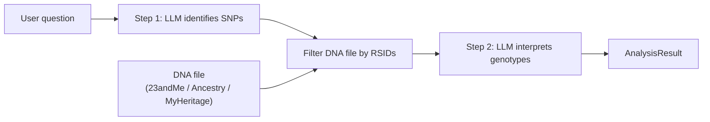

# DNA RAG

> Analyse your personal DNA data using Large Language Models.

**DNA RAG** is a Python pipeline that answers questions about personal genetic data from consumer DNA testing services (23andMe, AncestryDNA, MyHeritage). It uses a two-step LLM approach:

1. **SNP identification** -- the LLM determines which genetic variants (SNPs) are relevant to the user's question.
2. **Interpretation** -- the user's DNA file is filtered for those variants, and the LLM interprets the matched genotypes.

## Architecture



### Key Design Principles

- **LLM-agnostic** -- each pipeline step can use a different LLM provider. Use a reasoning model for SNP identification and a cheaper model for interpretation.
- **Pluggable** -- cache backends, LLM providers, and DNA parsers are all defined via Python Protocols and injected via constructor.
- **Structured output** -- Pydantic models validate LLM responses and pipeline results.

## Supported DNA Formats

| Format | File type | Delimiter | Notes |
|--------|-----------|-----------|-------|
| 23andMe | `.txt` | Tab | Comment lines `#` |
| AncestryDNA | `.txt` | Tab | Two allele columns merged |
| MyHeritage | `.csv` | Comma | `RESULT` column renamed |

Auto-detection reads the first few lines to identify the format.

## Installation

```bash
# Core only
pip install .

# With development tools
pip install ".[dev]"
```

## Configuration

All settings are loaded from environment variables with the `DNA_RAG_` prefix, or from a `.env` file.

```bash
cp .env.example .env
# Edit .env with your API key
```

### Core Settings

| Variable | Default | Description |
|----------|---------|-------------|
| `DNA_RAG_LLM_API_KEY` | *required* | API key for the LLM provider |
| `DNA_RAG_LLM_PROVIDER` | `deepseek` | `deepseek` or `openai_compat` |
| `DNA_RAG_LLM_MODEL` | `deepseek-r1:free` | Model name |
| `DNA_RAG_LLM_BASE_URL` | `https://api.deepseek.com/v1` | API base URL |
| `DNA_RAG_LLM_TEMPERATURE` | `0.0` | Sampling temperature |
| `DNA_RAG_LLM_TIMEOUT` | `60.0` | Request timeout (seconds) |
| `DNA_RAG_LLM_MAX_RETRIES` | `3` | Max retries on failure |

### Per-Step LLM (Optional)

Use a separate LLM for the interpretation step:

| Variable | Description |
|----------|-------------|
| `DNA_RAG_LLM_INTERP_PROVIDER` | Provider for interpretation step |
| `DNA_RAG_LLM_INTERP_API_KEY` | Separate API key (falls back to primary) |
| `DNA_RAG_LLM_INTERP_MODEL` | Model name for interpretation |
| `DNA_RAG_LLM_INTERP_BASE_URL` | API URL for interpretation |

### Cache & Logging

| Variable | Default | Description |
|----------|---------|-------------|
| `DNA_RAG_CACHE_BACKEND` | `memory` | `memory` or `none` |
| `DNA_RAG_CACHE_MAX_SIZE` | `1000` | Max entries per cache namespace |
| `DNA_RAG_CACHE_TTL_SECONDS` | `3600` | Cache TTL in seconds |
| `DNA_RAG_LOG_LEVEL` | `INFO` | Logging level |
| `DNA_RAG_LOG_FORMAT` | `console` | `console` or `json` |

## Quick Start

```bash
export DNA_RAG_LLM_API_KEY=your-key-here

# Single question
dna-rag ask --dna-file path/to/dna.txt --question "lactose tolerance"

# JSON output
dna-rag ask --dna-file path/to/dna.txt --question "lactose tolerance" --output-format json

# Interactive session
dna-rag interactive --dna-file path/to/dna.txt
```

## Python API

```python
from pathlib import Path
from dna_rag import DNAAnalysisEngine, Settings
from dna_rag.llm.deepseek import DeepSeekProvider
from dna_rag.cache import InMemoryCache

settings = Settings()  # reads DNA_RAG_* env vars
engine = DNAAnalysisEngine(
    snp_llm=DeepSeekProvider(settings),
    cache=InMemoryCache(),
)

result = engine.analyze("lactose tolerance", Path("my_dna.txt"))
print(result.interpretation)
print(f"Matched {result.snp_count_matched}/{result.snp_count_requested} SNPs")
```

### Per-Step LLM Selection

```python
from dna_rag.llm.deepseek import DeepSeekProvider
from dna_rag.llm.openai_compat import OpenAICompatProvider

# Reasoning model for SNP identification
snp_settings = Settings(llm_model="deepseek-r1:free")
# Cheaper model for interpretation
interp_settings = Settings(
    llm_provider="openai_compat",
    llm_api_key="sk-...",
    llm_model="gpt-4o-mini",
    llm_base_url="https://api.openai.com/v1",
)

engine = DNAAnalysisEngine(
    snp_llm=DeepSeekProvider(snp_settings),
    interpretation_llm=OpenAICompatProvider(interp_settings),
    cache=InMemoryCache(),
)
```

## Project Structure

```
src/dna_rag/
    __init__.py          # Public API
    config.py            # Pydantic Settings
    engine.py            # Core 2-step pipeline
    exceptions.py        # Exception hierarchy
    models.py            # Pydantic data models
    logging.py           # structlog configuration
    cli.py               # Click CLI
    cache/               # Cache protocol + in-memory implementation
    llm/                 # LLM protocol + DeepSeek / OpenAI-compat providers
    parsers/             # DNA file parsers (23andMe, AncestryDNA, MyHeritage)
```

## Development

```bash
# Install in editable mode with dev tools
pip install -e ".[dev]"

# Run tests (128 tests, 90% coverage)
pytest

# Type checking
mypy src/

# Linting
ruff check src/ tests/
```

## API Architecture

See [ARCHITECTURE.md](ARCHITECTURE.md) for the proposed FastAPI service design.

## License

Apache 2.0
